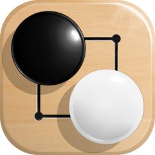

# Simple Go

A single-player Go (Baduk) board for Android, with a computer opponent. 9x9,
13x13 and 19x19, area scoring, configurable komi and handicap, and a territory
overlay.

Package: `com.ablweb.simplego`
Source: https://github.com/ablweb/SimpleGo

## Licence

All rights reserved; no licence is granted to this app's own code.

The computer opponent is [KataGo](https://github.com/lightvector/KataGo), MIT
licensed and vendored in `native/katago/`. See
[THIRD_PARTY_LICENSES.md](THIRD_PARTY_LICENSES.md) for the full attribution and
the list of what was and was not modified.
